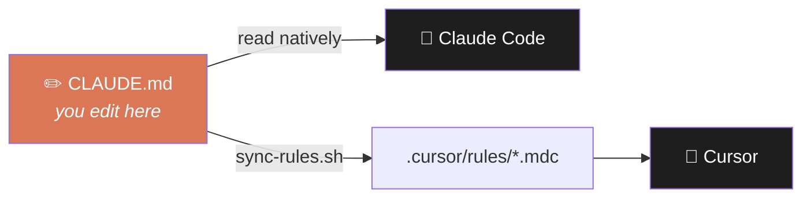

<div align="center">

# 🧠 ai-dotfiles

### Make Claude Code & Cursor work the way *you* think — same rules, real memory, always in sync.

It's not a blank `.cursorrules` to fill in. Under the hood is a worked-out system — **principles, memory, and a safe workflow** — kept as one source of truth that syncs to both tools and grows with you. No more drifting configs, no more re-explaining context to an assistant that forgot where you left off. Sysadmin runbooks for macOS and your servers come along for the ride — but the real product is *how your assistant works with you*.

[⚡ Quick Start](#quick-start) · [🚀 Why it's different](#why-its-different) · [📦 What's inside](#whats-inside) · [🧭 Philosophy](#philosophy) · [❓ FAQ](#faq)

</div>

---

## Quick Start

```bash
git clone git@github.com:VladimirAppre/ai-dotfiles.git ~/projects/ai-dotfiles
cd ~/projects/ai-dotfiles

# Open in Claude Code or Cursor — the rules are already active.
# Edit CLAUDE.md, then sync them to Cursor:
./scripts/sync-rules.sh

# For server/sysadmin work, create your local machine map:
cp SYSTEM.example.md SYSTEM.md
```

That's it — your assistant follows the same rules in both tools.

---

## Why it's different

Your `CLAUDE.md` and `.cursorrules` are dotfiles too — the config that shapes how your AI thinks. This repo treats them as exactly that, and fixes the two things every AI-assisted developer fights daily:

### 🔄 Same AI rules in Claude Code *and* Cursor — no copy-paste, no drift


Stop maintaining `CLAUDE.md` and `.cursorrules` by hand and watching them fall out of sync. Here you edit **one file**, run one command, and both tools get identical behavior:



```bash
./scripts/sync-rules.sh
# synced: CLAUDE.md           → .cursor/rules/main.mdc
# synced: modules/sysadmin.md → .cursor/rules/sysadmin.mdc
```

One source of truth. Both editors stay perfectly aligned — including on-demand modules that only load when the task matches.

### 🧠 Your AI never loses the thread when the context window fills up

Context full? Session crashed? Picked it up the next morning? Every task lives in a markdown file with a **"Last Checkpoint"**. When you return, the AI reads the checkpoint and resumes from the exact step — no re-explaining, no lost progress.

```
tasks/active/20260617_setup-nginx.md   ← in progress, with checkpoint
tasks/done/20260602_machine-backup.md  ← completed, archived
```

> The difference between *"let me re-read everything to figure out where we were"* and *"resuming step 3 of 5."*

---

## What's inside

| | |
|---|---|
| 🛡️ **Safe-by-default workflow** | 3-phase protocol — Analyze → Confirm → Implement — for anything risky |
| 🧩 **Core + on-demand modules** | A domain-neutral core travels anywhere; the sysadmin module loads only when the task needs it |
| 🍎 **macOS runbook** | Command reference: `defaults write`, launchd agents, SSH, system info |
| 🖥️ **Ubuntu server runbook** | nginx, SSL, ufw, systemd, cron — step by step |
| 🗂️ **Server inventory** | Each server gets its own folder with docs and a `.env` template |
| 🗺️ **Machine map** | `SYSTEM.md` keeps each machine's state so the assistant never re-discovers it |
| 📐 **Decision log** | Every non-obvious choice documented with its reasoning |

---

## Structure

```
CLAUDE.md              AI rules — the single source of truth
.cursor/rules/         Auto-generated by sync-rules.sh — don't edit by hand
scripts/
  sync-rules.sh        Regenerate Cursor rules from CLAUDE.md
tasks/                 Active + done tasks, each with a checkpoint
modules/
  sysadmin.md          On-demand AI context (loads only for server work)
platforms/
  macos/               defaults write, LaunchAgents, SSH, system info
  ubuntu-server/       Initial setup, nginx, systemd, ufw, certbot
servers/               Per-server README + .env.example (secrets gitignored)
docs/
  decisions.md         Architecture decisions with reasoning
SYSTEM.md              This machine's state — gitignored, filled per machine
_memory_template.md    Template for the assistant's persistent memory files
```

---

## Platform support


| Platform | Status | Use case |
|----------|--------|----------|
| macOS (Apple Silicon) | ✅ Primary | Daily driver — all features |
| Ubuntu Server | ✅ Active | Remote server admin |

---

## FAQ

**Can I really use the same rules in Claude Code and Cursor?**
Yes. `CLAUDE.md` is read natively by Claude Code. `sync-rules.sh` regenerates it into `.cursor/rules/*.mdc` so Cursor follows the exact same rules. Edit once, sync, done.

**What happens when the AI runs out of context mid-task?**
Nothing is lost. The task file holds a "Last Checkpoint" — when you start a new session, the AI reads it and continues from the precise step it stopped on.

**Do I have to use the AI features?**
No. The sysadmin runbooks (macOS and servers) and templates are useful on their own, even if you never touch the AI rules. The AI workflow is the heart of the project — but it's not a requirement.

**Does it work on Linux or Windows?**
macOS is the primary daily-driver target. Ubuntu is supported for remote server administration. The AI rules and task system are OS-agnostic.

**Will it overwrite my existing config?**
No. There's no installer that touches your system — you take what you want from the repo, and `sync-rules.sh` only writes inside the repo's own `.cursor/rules/`. Everything lives in git, so any change is reversible.

---

## Philosophy

> ### You don't *configure* an assistant. You *engineer* one.

Most setups treat AI rules as throwaway preferences — a `.cursorrules` here, a system prompt there, copy-pasted and forgotten. This repo treats them as what they really are: **the source code of how your assistant thinks, remembers, and acts.** Build them with the care you'd give real code, and the assistant stops being clever autocomplete and starts being a teammate that holds the line.

Six principles hold it together:

**1 · Principles over procedures.** A small core of engineering values — think before coding, simplicity, surgical changes, goal-as-criterion, honesty. Everything serves them. When a rule fights a principle, you *fix the rule*. Behavior is defined by **why**, never just *what*.

**2 · The rules obey their own rules.** No duplication, no bloat, ceremony that scales with risk. The methodology holds itself to the standard it demands of you — including the right to say *"I don't know"* and to call something *"done"* only once it's verified.

**3 · Memory beats re-discovery.** State, decisions, and tasks with checkpoints live on disk. The context window resets; the work doesn't. The assistant resumes at *step 3 of 5* instead of asking "where were we?"

**4 · One canon, many surfaces.** A single source of truth compiles into rules for both Claude Code and Cursor. Same behavior on every tool — zero drift, by construction.

**5 · Core that travels, modules that sleep.** A domain-neutral core goes to any project; specialized knowledge wakes only when the task calls for it. The assistant never carries weight it isn't using.

**6 · A hub, not a leash.** You come here to *author and apply* your methodology — it isn't injected into everything you touch. Your other projects keep their own voice. This is where the thinking lives, and spreads on purpose.

> *The engineering core — think first, simplicity, surgical changes, goal-driven — is adapted from [Andrej Karpathy's engineering principles](https://github.com/multica-ai/andrej-karpathy-skills/). Honesty and the rest are built on top. Credit where it's due — good ideas are worth standing on.*

> **Behavior and memory are artifacts worth designing as carefully as code.**
> That's the whole idea — and the rest of this repo is proof it works.

---

<div align="center">

If this saved you time, a ⭐ helps others find it.

[](LICENSE)

</div>
